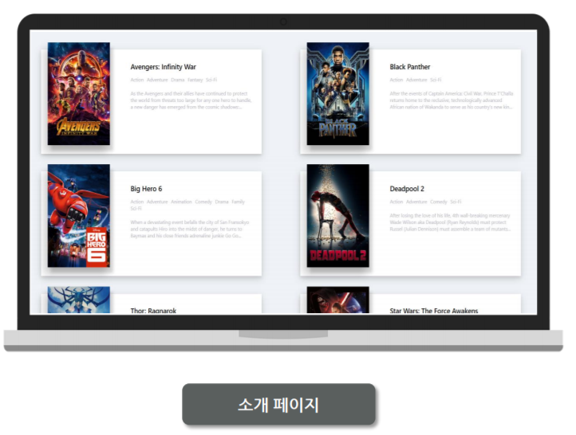

React - MovieWeb
===

## [서비스 설명]
Movei API로 영화 정보를 받아와 컴포넌트 단위로 데이터를 뿌려주는 토이앱
 
## [공부 내용 정리]

#### 1-1. Introduction to React

why react cool?

1.it's based javascript
	-function, object, variable
	-it will be make you a better js developer

2.Composition (구조)
	-요소별, 컴포넌트별로 나눠서 작업할 수 있게 되어 있다.

	
	
	<Nav>, <Header>, <Numbers>, <Grid> => 요소
	요소별로 나눠서 작업할 수 있다. 그룹별로 쪼개서 작업할 수 있다는 뜻. 즉, 다른 곳에서 사용할 수 있다는 것
	
	
	JSX=> 리액트로 html을 쓰는 방법.
	
3.Undirectional Dataflow (단방향 데이터플로우)
	-Data is on the state
	-The UI displays the data
	-If the state changes, the UI updates.
	-Data => UI (O)
	-UI => Data (X)
	
	즉, 데이터는 항상 일정한 장소에 위치해있고, 그 장소에서만 변경할 수 있다.
	Angular의 경우, 데이터는 view나 model로 변한다.
	React의 경우 데이터는 위치한 장소에 있고, 상태가 변했을 경우, 데이터는 그대로 있고, UI가 업데이트 된다.
	=> UI는 절대로 데이터를 변경시키지 않는다. 데이터가 변하면 UI가 업데이트됨.
	=> 데이터가 안변하면 UI도 안변한다.
	
4.React는 프레임 워크가 아니라 UI library다.
	-리액트는 View이기 때문에 파이썬, 루비랑 섞어 쓸 수 있다.
	-model, view, controller에서 리액트는 view 이기 때문에 나머지는 원하는대로 골라서 사용할 수 있다.
	-React를 장고, 루비온레일즈, nodejs랑 섞어 사용 가능
	
#### 1-2. What are we building

	-영화 데이터 뽑을 때, YTS.ag API 이용 (영화리스트, 추천, 별점 제공)
	
	
#### 1-3. Introduction to Create React App
	-우리가 사용하는 코드는 리액트 코드다. 그래서 이걸 자바스크립트로 바꿔주는 툴이 필요하다. 이걸 트랜스 파일러 라고 한다.
	-우리는 웹팩을 사용할 거다. 웹팩은 리액트 코드를 브라우저가 이해할 수 있는 코드로 변경해주는 역할을 한다.
	-자바스크립트는 버전이 다양하다. 최근에는 ES 6 => 문제는 모든 브라우저가 이해하지 못한다는 것. 따라서, 웹팩을 이용해서 최근 자바스크립트를 브라우저가 이해할 수 있게 변경해줘야 한다. 
	
	
	
	-웹팩은 굉장히 복잡하다. 이를 위해 FB에서는 create-react-app을 제공해준다. 인스톨하고 바로 코딩 시작하면 된다.
	
#### 1-4. Hello World with React and CRA

	yarn
	https://github.com/facebook/create-react-app
	
	설치
	# npm install -g create-react-app
	
	폴더 설치
	#yarn create react-app my-app
	
	시작
	#yarn start
	start라는 javascript 파일 이용.
	미리 개발된 서버(pre-built development server) 형태
	
	*CRA(Create React App)
	-configuration 필요 없이 바로 개발서버를 만들어 준다.
	
#### 2-1. Creating React Components with JSX
	
	React 프로젝트를  시작하기 전, 가장 먼저 하는 것. 컴포넌트 디자인!
	스케치 프로그램을 활용해서 디자인
	
	컴포넌트
	1.무비리스트 컴포넌트 (앱 컴포넌트, 빨간색)
	2.각각의 영화 카드 컴포넌트 (무비 컴포넌트, 파란색)
	3.이미지 컴포넌트
	
	JSX는 리액트 컴포넌트를 만들 때 사용하는 언어다. 규칙은 굉장히 심플하다.
	컴포넌트는 각기 다른 functions와 methods를 갖고 있다.
	모든 컴포넌트는 render function을 갖고 있다.
		-render란 이 컴포넌트가 나에게 보여주는 것이 무엇인가 이다.
		
	우리가 yarn start 명령어를 실행하면 모든 코드를 가져와서, html 파일에 담는다.
	
	we are creating file on index.js
	
	*what's the difference react & react DOM
	react: Library to builde UI
	react DOM(Document Object Model): 리액트를 웹사이트에 출력(render)하는 걸 도와주는 모델
	
	리액트를 사용해서 웹 사이트에 올려놓고 싶다? => reactDOM
	리액트를 모바일 앱에 올려놓가 싶다? => reactNative
	
	리액트 돔은 1개의 컴포넌트를 출력(render) 하고,
	ReactDOM.render(<App/>, document.getElementById('root');
	(그 다큐먼트 안에 엘리먼트가 있는데, 엘리먼트 id는 root다. 이건 index.html 파일에 있다.)
	
	*프로세스
	1.컴포넌트 생성(Movie.js 파일 생성, import react, component) -> 렌더(class 생성, render, Movie class Component 생성) -> 리턴 -> <html> -> 확인
	
	App 컴포넌트가 대빵, Movie라는 이름의 작은 꼬맹이 컴포넌트들이 있는 모델구현
	
#### 2-2. Dataflow with Props

	리액트에는 2개의 주요 컨셉이 있다. 하나는 state, 나머지 하나는 props.
	App 컴포넌트는 모든 데이터를 갖고있고, 정보를 자식 컴포넌트들에게 전달해준다. props를 통해서.

	데이터의 소스는 한 곳 뿐이다. 
	메인 컴포넌트가 데이터를 다 가지고 있다.
	타이틀, 영화 포스터 정보를 메인에 다 집어넣고, 그걸 각각 컴포넌트에 props를 이용해 정보를 출력하는 것이다.
	
	강력한 UI를 구축할 수 있게 된다. 왜?
	한 개의 데이터 소스를 가지고 각 컴포넌트 별로 출력 해주기만 하면 되기 때문이다.
	
#### 2-3. List with .map

	array를 일일이 만들어주는 것이 아니라, 훨씬 간단하게 arry를 사용할 수 있는 map의 활용법 배움.

#### 3-1. Lifecycle Events
	
	컴포넌트는 여러 기능들을 정해진 순서대로 실행한다. 그걸 Component LifeCycle이라고 한다.
	
	Render:
	(1) componentWillMount
	(2) Render
	(3) componentDidMount
	
	Update:
	(1) componentWillReceiveProps
	(2) shouldComponentUpdate
		-react는 old props, new props를 살펴본 다음 이전과 새로운 props가 다르면, update=true
	(3) component will update
		-component가 업데이트 될 것이다.
		-이 작업을 수행할 때, 애플리케이션에 뱅글뱅글 돌아가는 spinner를 붙일 수도 있다.
	(4) render
	(5) componentDidUpdate
		-로딩 중 메세지를 숨기면 된다.
		
#### 4-1. Thinking in React: Component State

	state는 리액트 컴포넌트 안에 있는 오브젝트이다.
	컴포넌트 안에 있는 state가 바뀔 때 마다, 컴포넌트는 다시 render 한다.
	
	아래와 같이 state의 상태는 직접 변경할 수 없다.
	this.state.greeting = "something";
	
	state의 상태를 바꿀때는 setState를 설정해준다.
	업데이트가 발생할 때 마다 render가 다시 작동한다. 새로운 state와 함께
	
#### 4-2. Practcing this.setState()

#### 4-3. Loading States

	대부분의 앱들의 경우 필요한 데이터가 항상 바로 존재하지는 않을거다.
	데이터없이 컴포넌트가 로딩을 하고, 데이터를 위해 API를 불러서, API가 데이터를 넘겨주면, 너의 컴포넌트 state를 업데이트 하겠지.
	
	API 콜을 타임아웃 기능으로 유사하게 구현해보자.                       
	
#### 5-1. Smart vs DumbComponents

	모든 컴포넌트가 state를 갖고 있는 건 아니다. state가 없는 컴포넌트를 stateless functional component라고 한다.
	
	SmartComponent: 
		state가 있다.
		
	
	DumbComponent: (stateless functional Component)
		-1개의 props (like poster) , 1개의 html 태그
		-state가 없다. props만 갖고 있다.
		-component will mount, function, update state 함수들 필요 없음.
	       -이 컴포넌트는 그냥 return을 하기 위해 존재한다. (코드가 간결해짐)
		-다만, state가 존재하지 않기 때문에 UI를 업데이트 하는 작업은 불가능 해짐.
		-this.props는 사용할 수 없다. 클래스가 아니기 때문이다.                                                                                                                                                                                                                                                                                                                                                                                                                                                                                                                                                                                                                                                                                                                                                                                                                                                                                                                                                                                                                                                                                                                                                                                                                                                                                                                                                                                                                                                                                                                                                                                                                                                                                                                                                                          
	
#### 6-1. Ajax in React

	Ajax (Asynchronous JavaScript and XML->Json)
	-XML은 너무 오래되서 Json 형태(포멧)로 바뀌는게 맞다.
	-JSON(JavaScript Object Notation) - 오브젝트를 자바스크립트로 작성하는 기법
	-Ajax는 url을 자바스크립트로 비동기 방식으로 불러온다.
	Ajax를 React에서 쓰는 방법은 아주 간편하다.
	(http request 참고)
	-FETCH 덕분이다. (FETCH를 이용해 URL을 통해 정보를 GET 한다.)
	
	
	=>list_movies.json?sort... 이 부분에서 API 데이터 불러온다.
	
	왜 우리는 Ajax를 쓸까?
	-뭔가를 불러올 때마다 페이지를 새로고침 하지 않아도 되기 때문에
	-로딩을 하면 API를 불러온다. 평점을 가져오기도 하고.
	-자바스크립트와 같이 데이터를 다룰 수 있다. (뒤에 숨어서)
	
#### 6-2. Promises

	Promise는 자바스크립트의 새로운 컨셉이다.
	Promise는 Asynchronous다. => 첫 번째 라인의 작업이 끝나든 말든, 두 번째 작업을 진행한다는 뜻.
	Promise는 시나리오를 잡는 방법을 만들어준다.
		성공: 여자친구와의 약속에 성공 => 영화보러감
		실패: 여자친구와의 약속에 실패 => 영화 못봄
		
		즉, 2가지의 시나리오가 있고, 이를 관리할 수 있게 해준다.
		
	Fetch와 Promise를 통해 시나리오를 관리할 수 있게 된다.
	response를 보면 다음과 같이 구성된 걸 볼 수 있다.
	
	body: ReadableStream => 바이트(010101...)로 이루어졌다는 뜻이다. 이걸 jSON으로 바꿔줘야 한다.
	
	Object를 json type으로 바꾸면 위와 같이 바뀐 응답 값을 볼 수 있다.
	API의못생긴데이터를response체크=>json으로변환=>콘솔로확인
	
	FETCH가 좋은 이유는 url을 Ajax로 불러올 수 있기 때문이다. 그것도 아주 쉽게!
	
	XML로 데이터 불러 올 때는 다음과 같이 불러왔다.	
	=>
	fetch("url..")
	이렇게 쉽게 한 줄로 봐꼈다.!
	
#### 6-3. Async Await in React

	Async / Await는 Promise , then을 더 분명하게 작성하는데 도와주는 도구.
	Async / Await를 쓰지 않으면 callback hell에 빠질 가능성이 높아진다. then(() => then(then => then())) ...
	
	Await means that we want to wait for the Promise() to finish before continue.
	
	Await variable cant use inside a non async.
	
	모든걸 컴포넌트로 쪼개고, 작게 만드는 것이 더 세련된 코드다.
	

#### 7-2. Giving some CSS to movie

	Ellipsis 라이브러리
	-텍스트가 길 때, 라인을 설정해주면 그 이상의 텍스트는 '...'과 같이 나타내주는데 도움을 줌
	
	설치
	# yarn add react-lines-ellipsis

	깃헙은 static files를 공짜로 호스팅 해준다.
	깃허브는 코드를 보여주지, 실행을 하지는 않는다.
	gh-pages는 코드를 실행을 하고, 웹사이트로 보인다.

	npm run start = yarn start

	호스팅 방법
	
	1.yarn build 명령어 입력
	=>css를 가져다가 압축을 한다. build라는 public 폴더에 넣는다.
	=>코드를 최적화시켜주고, 압축시켜서 성능이 더욱 향상 된다.
	=>와... 원리가 어떻게 되는 것일까?

	2.package.json 파일 이동
	-key를 추가해 준다.
	-"homepage": "http://Seopftware.github.io/react-tutorial-movieweb"
	
	그리고 다시 yarn build 명령어 입력. (설정 내용이 봐꼈기 때문이다.)
	
	3.그럼 다시 안내가 나온다.
	# yarn add --dev gh-pages
	
	"scripts":{
		"predeploy":"npm run build",
		"deploy":"gh-pages -d build"
	}
	
	4.배포하자
	
	배포 명령어
	# yarn run deploy

	# yarn add react-lines-ellipsis

## [참고링크]
* [노마드 코더](https://academy.nomadcoders.co/courses)